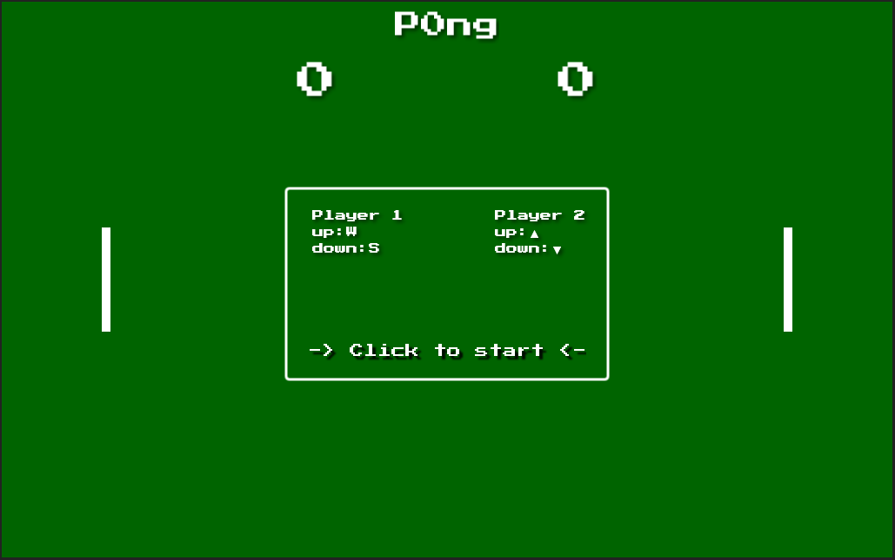

# P0ng

A clone of the classic [Pong](https://en.wikipedia.org/wiki/Pong)

[Play](http://pong.fastner-it.de)



This game was created with the awesome [Phaser NPM Webpack TypeScript Starter Project](https://github.com/rroylance/phaser-npm-webpack-typescript-starter-project)

**Big thank you to them**

# Setup

## Install dependecies

```npm install```

## Run the dev server:

Run to use the dev build while developing:

```npm run server:dev```

## Build for release:

```npm run build:dist```
